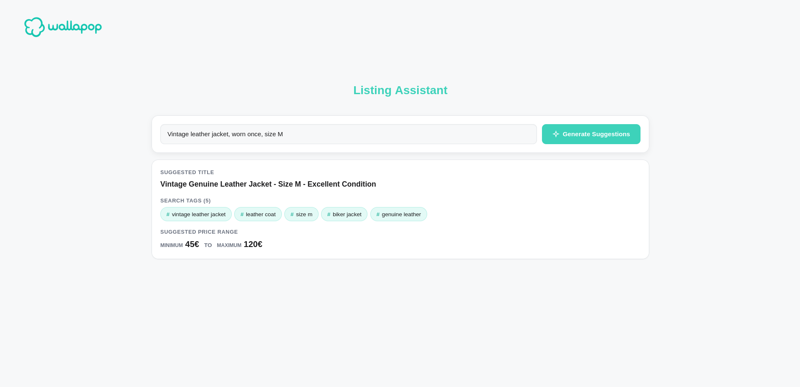
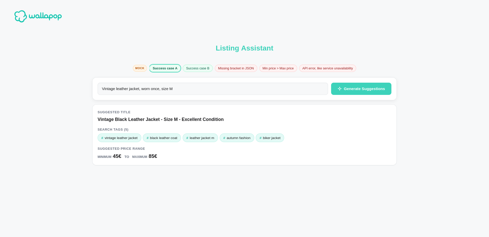

# Exercise Listing Assistant
This is the Listing Assistant for the Wallapop Interview.

The application consists of a full stack app made with Angular for the frontend and Node.js (express) for the backend, the model used is Gemini for generation of listing suggestions.

# Features

Given a rough item description from a seller, the assistant generates structured listing recommendations:

- **Title**: A clear, optimized product title.
- **Search Tags**: 3 to 5 lowercase, search keywords.
- **Price Range**: Minimum and maximum value estimates.

The application operates in two distinct modes:

### API Mode
Connects directly to Google's Gemini model to generate live AI suggestions for any custom item description.



### Mock Mode
Enables full testing without requiring a `GEMINI_API_KEY`. It includes interactive scenario pills in the UI:
- **Success Scenarios (2)**: Returns valid, structured listing suggestions.
- **Error Edge Cases (3)**: Tests resilience against malformed JSON, invalid price logic (`minPrice > maxPrice`), and simulated upstream service outages (`503`).
- **Custom Inputs**: Typing a custom description randomly returns one of the mock responses or simulated errors.



# Requirements

- **Node.js**: `>= 22.6.0` (Recommended: `v22.x` LTS)
- **npm**: `>= 10.0.0` (Recommended: `10.9.x`)

# Getting started

### 1. Backend Setup

Open a terminal and navigate to the `backend` directory:

```bash
cd backend
npm install
```

#### Environment Configuration
Copy the example environment file to create your `.env`:

```bash
cp .env.example .env
```

- **For Mock Mode (Default)**: No API key is needed. `MODE=MOCK` is already set.
- **For API Mode**: Set `MODE=API` and paste your Gemini API key:
  ```env
  GEMINI_API_KEY=your_gemini_api_key_here
  MODE=API
  ```

#### Run the Backend

```bash
# Start backend (uses the MODE set in your .env)
npm run dev

# Or explicitly force a mode:
npm run mock   # Runs in MOCK mode
npm run api    # Runs in API mode (requires GEMINI_API_KEY)
```

The backend server will start on `http://localhost:3000`.

---

### 2. Frontend Setup

Open a second terminal and navigate to the `frontend` directory:

```bash
cd frontend
npm install
```

#### Run the Frontend

```bash
# Start in Mock mode (default)
npm run dev

# Or explicitly choose the mode:
npm run mock   # Mock mode (displays mock scenario pills)
npm run api    # API mode (clean UI for live Gemini generations)
```

---

### 3. Open the Application

Once both servers are running, open your browser and navigate to:

👉 **[http://localhost:4200](http://localhost:4200)**

- **Mock Mode**: Click any of the scenario pills to test simulated success cases, error handling, and formatting rules without consuming API quota.
- **API Mode**: Type any product description (e.g. *"Vintage leather jacket, worn once, size M"*) and click **Generate Suggestions** to receive live AI recommendations.

# Test coverage

- **Backend**: Unit tests for `modelResponseValidator` (core domain rules and schema validation), `MockProvider` (fuzzed responses and simulated delay), and API endpoint integration tests in `app.test.ts` (request validation, status codes, and error handling).
- **Frontend**: Component tests for the `Assistant` page using `HttpTestingController` to mock HTTP responses and verify UI behavior, form states, and error alerts.

These tests cover the main functionality of the application. With more time, additional tests could be added for `GeminiProvider` and the `listingRequestValidator` (backend) and `AssistantService` (frontend), as well as end-to-end (E2E) tests.

### Running Backend Tests

Navigate to the `backend` directory:

```bash
cd backend

# Run tests in Mock mode (recommended — fast, zero external API quota used)
npm run test:mock

# Run tests in live API mode (requires GEMINI_API_KEY in .env)
npm run test:api

# Run all test suites
npm test
```

### Running Frontend Tests

Navigate to the `frontend` directory:

```bash
cd frontend

# Run all component and unit tests once
npm test -- --watch=false

# Or run tests in interactive watch mode
npm test
```